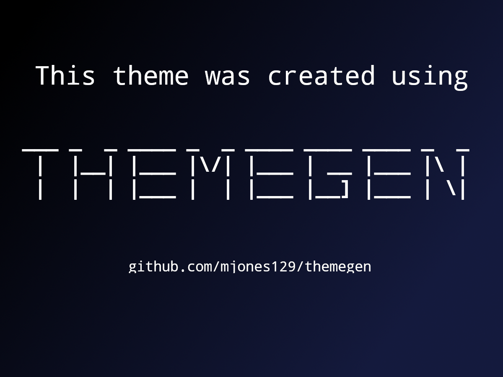

# A Minimalist WordPress Theme Generator

ThemeGen is a bare-bones WordPress theme generator that happens entirely in the terminal. Simply answer a few questions and generate basic theme files instantly.




## Requirements:
* WordPress version 6.3.1 or higher
* PHP version 8.2 or higher
* NodeJS version 18.18 or higher
* Git

## How Does It Work?
1. Open a terminal window and navigate to your empty theme folder like so: ```cd wp-content/themes/emptyThemeFolder```.
2. Clone this repository. ```git clone https://github.com/mjones129/themegen.git .```
3. Install deps by running ```npm install```.
4. Execute the ThemeGen file by running ```npm run themegen```.
5. Follow the prompts.
6. A new WordPress theme will be generated in your directory and your selected plugins will be downloaded and installed automagically.

## Video Demonstration
Below you'll find a quick example of how this generator is designed to work:


https://github.com/mjones129/themegen/assets/29353833/313eea76-3265-4f84-9485-e757bccfc5a2
